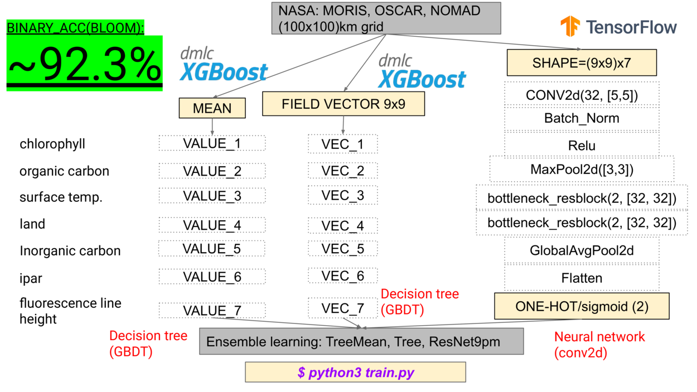

# The Great Bloom Theory

Submission:
[https://2019.spaceappschallenge.org/challenges/living-our-world/bloom-or-not-bloom/teams/the-great-bloom-theory/project](https://2019.spaceappschallenge.org/challenges/living-our-world/bloom-or-not-bloom/teams/the-great-bloom-theory/project)



## Install

```bash
$ /bin/bash install.sh
```

## Fetch and preprocess dataset

```bash
$ python3 dataset.py
```

## Train model

```
$ python3 train.py
```

## View results

Usage:

```
$ python3 visualisation.py
```

Customization:

```python3
if __name__ == "__main__":
    v = Visalisation(2019, 6) # date to predict
    v.prepare_dataset(3)      # data aggregation
    v.load_dataset()          # load to memory
    t = ModelTree()           # use our tree model
    t.load()                  # load model to memory
    v.visualise(t)            # run prediction and
                              # show world map
```
